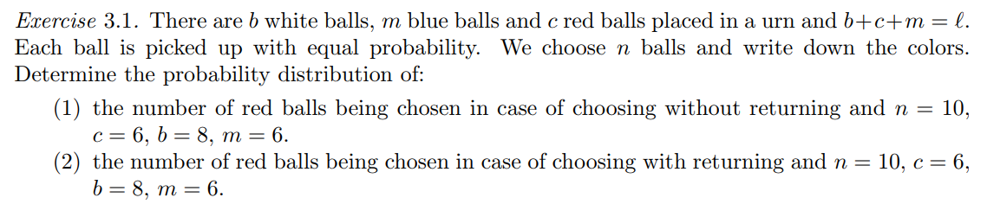

This repository contains a solution to one of the homeworks we were given at the Probability and Statistics course at Charles University. We had to implement an «algorithm» for a specific problem which would randomly pick an answer many times and approximate the actual probability. The problem is:  
  
  
I have implemented it in javascript with a nice interface and probability plots using Plotly. You can see how it works [here](https://alexfsmirnov.github.io/probability-homework).
